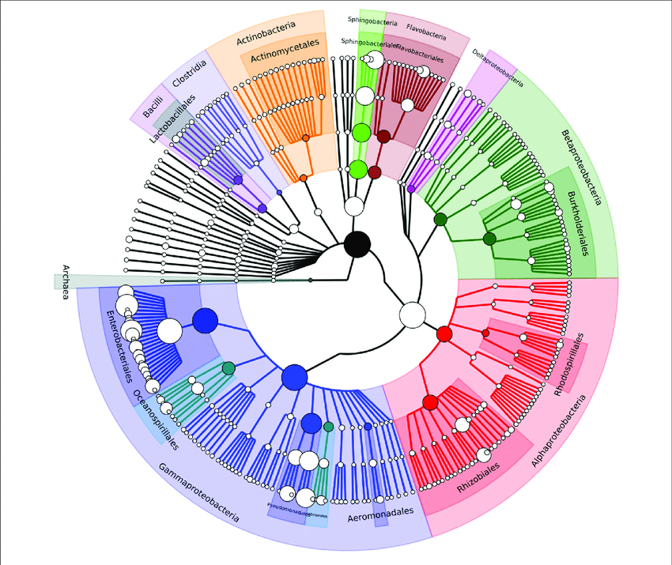

```{r setup, include=FALSE}
knitr::opts_chunk$set(
	echo = FALSE,
	message = FALSE,
	warning = FALSE
)
options(htmltools.dir.version = FALSE)
library(knitr)
library(phyloseq)
library(dplyr)
```

# Background

---

# Microbiome sequencing data


.pull-left[
- 16s rRNA gene sequencing
- shotgun metagenomic sequencing
]

.pull-right[

]


---

# Microbiome data example
```{r}
data <- readRDS("example_data.RDS")

d <- data %>%
  filter(author=="Weis et al., 2019") %>%
  dplyr::select(-c(1:3)) %>%
  dplyr::select_if(function(x) sum(x)!=0)

library(DT)
d %>%
  DT::datatable(extensions = 'FixedColumns',
  options = list(
  dom = 't',
  scrollX = TRUE,
  scrollY = TRUE,
  scrollCollapse = TRUE))
  

```
---


---


# Data characteristics

- High-dimensional
- Compositional
- Zero-inflated
- Multivariate
- Unequal sequencing depth
- Over-dispersion

---

# Aims

- Provide pratical advice for choice of method
- Evalute methods with respect to
  -- different data characteristics
  -- different taxonomic levels


---

# Data-generating mechanisms

- true data-generating mechanism unknown
- simulation based on probability model may not represent true data structure
- possible solution:
      - resampling from a large set of samples taken from healthy subjects
      - induce effects on top of resampling dataset using probability model
- comes with drawbacks
      - "spurious" effects due to resampling
      - effect of interest will be a combinations of "true" effect and noise in the data
- Data characteristics may vary with taxonomic depth
      - lower ranks:
            - dimensionality
            - zero-inflation
            - over-dispersion
      - higher ranks:
            - compositionality
      


---

# Estimands / Effects in microbiome data

---

# Methods

---

# Performance measures

---
