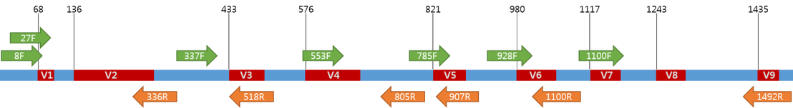

```{r setup, include=FALSE}
knitr::opts_chunk$set(
	echo = FALSE,
	message = FALSE,
	warning = FALSE
)
options(htmltools.dir.version = FALSE)
library(knitr)
library(phyloseq)
library(dplyr)
```

# Background

---

# Microbiome sequencing data


.pull-left[
- 16s rRNA gene sequencing
- shotgun metagenomic sequencing
- test
]

.pull-right[

]


---

# Microbiome data example
```{r}
data <- readRDS("example_data.RDS")

d <- data %>%
  filter(author=="Weis et al., 2019") %>%
  dplyr::select(-c(1:3)) %>%
  dplyr::select_if(function(x) sum(x)!=0)

library(DT)
d %>%
  DT::datatable(extensions = 'FixedColumns',
  options = list(
  dom = 't',
  scrollX = TRUE,
  scrollY = TRUE,
  scrollCollapse = TRUE))

```

???
- 300 genera
- Rows = Observations ; Columns = Bacteria ; each cell = counts
- highly variable abundance
- zero-inflation
- sequencing depth ; variable between observations
- higher taxonomic ranks by summing lower ranks up ; lower sparsity

---


# Data characteristics

- High-dimensional
- Compositional
- Zero-inflated
- Multivariate
- Unequal sequencing depth
- Over-dispersed

???

- here, 300, but possible up to multiple thousands
- multivariate; complex biological interactions
- over-dispersed ; relared to many used parametric models
- characteristics depend on taxonomic ranks

---

# Aims and challenges

.pull-left[
Challenges
- "neutral" evaluation of performance
- simulation of clustered / longitudinal effects
- evaluation of influence of data characteristics
- evaluation seperate for taxonomic ranks
]

.pull-right[
Aims
- guidance paper for (applied) researchers
- easily interpretable

]

---

# Data-generating mechanisms

- perfect model that reflects data-generating process unclear
- simulation based on parametric model may not represent true data structure
- possible solution:
      - resampling from a large set of samples taken from (healthy) subjects
      - parametric model "on-top" of resampled data
- drawbacks:
      - "spurious" effects due to resampling
      - effect of interest will be a combinations of "true" effect and noise in the data

---

# Data generating mechanisms
- $n_{obs} = [50,100,150,200,400,1000]$
- 


---

# Estimands / Effects in microbiome data

---

# Methods

---

# Performance measures

- Coverage  $$Pr(\hat{\theta}_{low} < \theta < \hat{\theta}_{upp})$$
- Power / type-I error rate $$ Pr(p_i \leq \alpha)$$
- Bias $$ E[\hat{\theta}] - \theta $$
- Empirical SE $$ \sqrt{Var(\hat{\theta})} $$
- MSE $$ E[(\hat{\theta} - \theta)^2] $$


---
