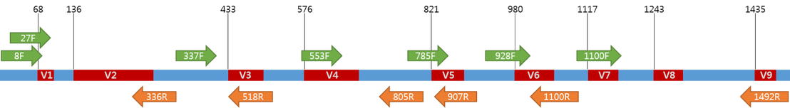
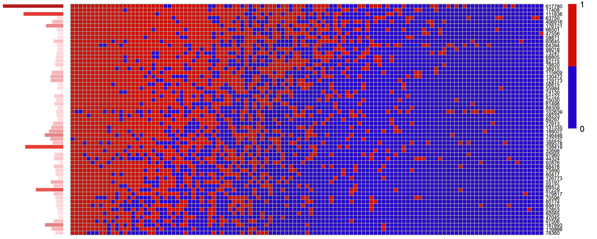

# Microbiome simulation study

## Microbiome data generating process

### Data characteristics
| Bifidobacterium | Adlercreutzia | Collinsella | Denitrobacterium | Eggerthella |      N |
|----------------:|--------------:|------------:|-----------------:|------------:|-------:|
|               0 |         11987 |           0 |                0 |         177 | 617780 |
|              73 |             4 |         335 |                0 |          12 |  17408 |
|             104 |             0 |        1387 |                0 |          21 | 111836 |
|            2716 |             0 |         574 |              125 |          12 |  63750 |
|              53 |          3971 |        3880 |                8 |           0 | 406916 |
|             815 |           462 |         951 |              176 |          79 | 176121 |
|             145 |           120 |         311 |               53 |          11 |  66501 |
|               0 |             0 |         416 |                0 |          76 |  47556 |
|              73 |             0 |           0 |                0 |         167 |  58871 |
|              17 |             6 |           0 |                0 |           0 |  60645 |

- High-dimensional
    - up to several thousand species
    - increasing dimensionality with lower taxonomic ranks
- Compositional
    - sequences always sum up to a constant (sequencing depth) / only relative
    - sequencing depth is variable between samples
    - effects of compositonality may be higher on higher ranks (diminished with very many categories)
- Multivariate
    - complex (biological) interactions between taxa
    - especially temporal interaction (Lotka-Volterra, etc.)
- zero inflated
    - substantial amount of zeros in the Data
    - 
    - different types of zeros
        - technical due to non-detection
        - true due to absence in the biological sample
- Unequal sequencing depth
    - certainty about proportions varies between samples
    - zero-inflation relared to sequencing depth - higher sequencing depth = higher probability to cover all present taxa
- Over-dispersed
    - related to parametric models for count Data
    - Mean-Variance association in Poisson models usually not met in microbiome data -> therefore, negative binomial
    - Multivariate extension in terms of dirichlet multinomial models assume constant scale parameter for over-dispersion, which is likely not met (highly variable over-dispersion per taxa)

## Aims and challenges of the simulation study

### Current practice
Most currently available simulation studies are part of the original publication of one particular method. Commonly, these publication use the model that is subject of benchmarking also to generate simulated data that is used for benchmarking, which is inherently favoring the proposed methods. However, often *real* data is much more complex and models are miss-specified due to missing information on possible confounders and other effects. These simulation studies usually do not investigate the sensitivity more realistic data structures. On the other hand, existing independent simulation studies1 avoided the use of parametric models by using resampling strategies on real microbiome data and inducing artificial effects either as additive or multiplicative _spikes_ in single taxa. Performance is then measured as the proportion of retrieval of these effects in a series of simulated datasets. Although these studies are well designed, the approach is providing a rather limited benchmark. At first, simple univariate spikes may not represent how true biological effects would emerge in microbiome data and implicitly favor univariate methods (as the effects are univariate by design). Further, a single performance measure is very limited in the information that it provides regarding the behavior of single methods. Commonly used performance measures (coverage, bias, empirical SE, among others) cannot be applied. The advantage of pure "retrieval" performance is, that it can be applied to a diverse set of parametric and non-parametric methods that provide different types of estimates and parameters.
Further, to my knowledge, no currently available simulation makes a clear distinction between different taxonomic ranks. As almost all data characteristics are related to the taxonomic rank, it is unlikely that there is one perfect method for all taxonomic ranks. Therefore, benchmarking should be performed separately to investigate possible differences in methods performance among different ranks.

# Literature
1Thorsen, Jonathan, Asker Brejnrod, Martin Mortensen, Morten A. Rasmussen, Jakob Stokholm, Waleed Abu Al-Soud, Søren Sørensen, Hans Bisgaard, und Johannes Waage. „Large-Scale Benchmarking Reveals False Discoveries and Count Transformation Sensitivity in 16S RRNA Gene Amplicon Data Analysis Methods Used in Microbiome Studies“. Microbiome 4, Nr. 1 (25. November 2016): 62. https://doi.org/10.1186/s40168-016-0208-8.
